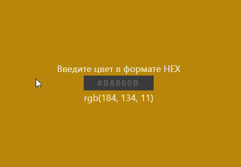

## HEX to RGB color converter

 

Реализована страница для конвертации цвета из формата **HEX** (шестнадцатеричное представление RGB) в формат **RGB**. 
После ввода цвета необоходимо нажать клавишу **Enter**.
Если формат введен не правильно - выбрасывается *ошибка*

 

